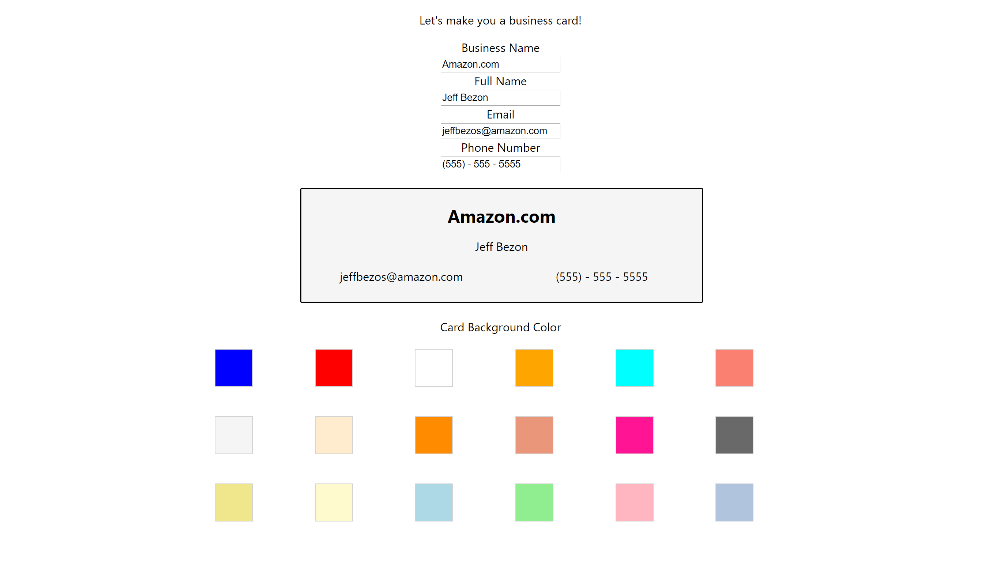

## React Hooks
An app to practice hooks for forms and click events.
Fill out a form and a hook sets state to update the current business card
After filling out the form, choose a new background color for a card, and a hook sets the background color

 ### Available Scripts
 Start app with 
 ``` npm start ```
